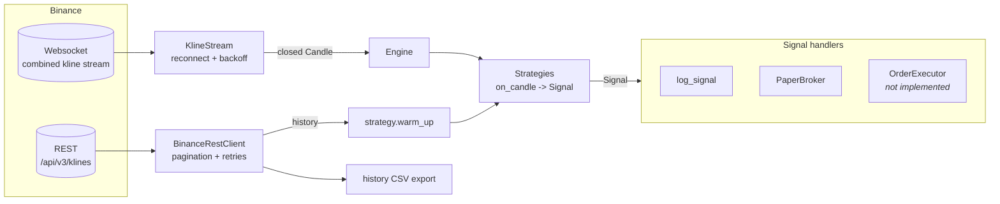

# Crypto Trading Bot with Binance API

[](https://github.com/nicholascomuni/Crypto-Trading-Bot-With-Binance-API/actions/workflows/ci.yml)
[](LICENSE)


Async Python foundation for a Binance trading bot: a solid market-data layer (REST history + live
websocket candles) and a small event-driven strategy framework. It runs in **signal / paper mode
only**: strategies emit signals and a simulated broker records hypothetical trades. **No orders are
ever sent to Binance.**

This is a personal project and a work in progress. The parts that exist are tested and meant to be
reused; order execution is on the [roadmap](#roadmap).

## What works today

| Area | Status |
| --- | --- |
| Historical candles (`GET /api/v3/klines`) with automatic pagination, retries, `Retry-After` and request-weight throttling | Done |
| Live closed candles for many symbols over one combined websocket, auto-reconnect with exponential backoff + jitter | Done |
| `Candle` model: immutable, `Decimal` prices, timezone-aware UTC timestamps, one parser for REST and websocket payloads | Done |
| Strategy protocol + example SMA crossover strategy, warm-up from REST history | Done |
| Engine routing candles to strategies and signals to handlers; paper broker and signal logger | Done |
| CLI: `stream` (live paper mode) and `history` (CSV export) | Done |
| Real order execution, risk limits, backtesting, persistence | [Roadmap](#roadmap) |

Only public, unsigned endpoints are used, so no API key is required.

## Architecture



- **`models.py`**: `Candle` dataclass; `Candle.from_rest` and `Candle.from_ws_event` share a
  single builder so both sources produce identical objects.
- **`rest.py`**: `BinanceRestClient` (httpx, async). `get_klines(symbol, interval, start, end)` pages
  through the API 1000 candles at a time. Transport errors, 429 and 5xx are retried with exponential
  backoff (honouring `Retry-After`); 418 (IP ban) and other 4xx are raised immediately. It watches
  `X-MBX-USED-WEIGHT-1M` and pauses until the next minute when usage nears the limit.
- **`stream.py`**: `KlineStream` is an async iterator of closed candles. It reconnects after drops,
  including Binance's forced disconnect every 24h, and fails fast on handshake errors that retrying
  cannot fix (e.g. HTTP 451 for restricted locations).
- **`strategy.py`**: `Strategy` protocol, `Signal`, and `SmaCrossStrategy`.
- **`engine.py`**: `Engine` sends each candle to every strategy and each signal to every handler.
  A failing strategy or handler is logged and skipped. `PaperBroker` is the only "execution" for now.
- **`config.py`** / **`cli.py`**: settings from environment variables; `python -m binance_bot`.

## Project structure

```
.
├── src/binance_bot/
│   ├── models.py      # Candle + parsing, time helpers
│   ├── rest.py        # async REST client (klines)
│   ├── stream.py      # websocket kline stream with reconnect
│   ├── strategy.py    # Strategy protocol, Signal, SmaCrossStrategy
│   ├── engine.py      # Engine, PaperBroker, log_signal
│   ├── config.py      # Settings from env
│   └── cli.py         # stream / history commands
├── tests/             # offline tests (mocked HTTP, fake websocket)
├── .env.example
└── pyproject.toml
```

## Quickstart

Requires Python 3.11+.

```bash
git clone https://github.com/nicholascomuni/Crypto-Trading-Bot-With-Binance-API.git
cd Crypto-Trading-Bot-With-Binance-API
python -m venv .venv && source .venv/bin/activate
pip install -e ".[dev]"
```

Stream live 1-minute candles and run the SMA crossover strategy in paper mode (Ctrl+C prints a
summary of the paper trades):

```bash
python -m binance_bot stream --symbols BTCUSDT,ETHUSDT --interval 1m
python -m binance_bot stream --symbols BTCUSDT --interval 5m --fast 5 --slow 20 --notional 250
```

Export history to CSV (dates are UTC unless an offset is given):

```bash
python -m binance_bot history --symbol BTCUSDT --interval 1h \
    --start 2024-01-01 --end 2024-02-01 --out data/btcusdt_1h.csv
```

The package also installs a `binance-bot` console script with the same commands.

Sample `stream` output. This run used a local fake websocket server with a synthetic price
series (including one forced disconnect), not live Binance data:

```
INFO    binance_bot.stream: Connected to ws://127.0.0.1:8765/stream?streams=btcusdt@kline_1m
INFO    binance_bot: BTCUSDT 2024-01-01 00:03:59 UTC close=7 O=1 H=1 L=1 V=1
WARNING binance_bot.stream: Stream closed by server
INFO    binance_bot.stream: Reconnecting in 0.9s
INFO    binance_bot.stream: Connected to ws://127.0.0.1:8765/stream?streams=btcusdt@kline_1m
INFO    binance_bot: BTCUSDT 2024-01-01 00:05:59 UTC close=10 O=1 H=1 L=1 V=1
INFO    binance_bot.engine: SIGNAL BUY BTCUSDT @ 10 [sma_cross_2_4] SMA2=8.00000000 crossed SMA4=7.75000000
INFO    binance_bot.engine: PAPER open BTCUSDT qty=10 @ 10
```

## Configuration

All settings are optional environment variables (see [`.env.example`](.env.example)):

| Variable | Default | Notes |
| --- | --- | --- |
| `BINANCE_REST_URL` | `https://api.binance.com` | `https://data-api.binance.vision` serves public market data only |
| `BINANCE_WS_URL` | `wss://stream.binance.com:9443` | `wss://data-stream.binance.vision` serves public market data only |
| `LOG_LEVEL` | `INFO` | Standard `logging` level |

To load a `.env` file into your shell: `set -a && source .env && set +a`.

Binance blocks some regions (HTTP 451 / 403). The stream raises instead of retrying forever in that case.

## Writing your own strategy

Any object with a `name` and an `on_candle(candle) -> Signal | None` method is a strategy. The engine
calls it with each closed candle, in order, for every subscribed symbol, so keep state per symbol:

```python
import asyncio
from decimal import Decimal

from binance_bot import Candle, Engine, KlineStream, PaperBroker, Side, Signal, log_signal


class BreakoutStrategy:
    """BUY when a candle closes above the previous candle's high."""

    name = "breakout"

    def __init__(self) -> None:
        self._prev_high: dict[str, Decimal] = {}

    def on_candle(self, candle: Candle) -> Signal | None:
        prev = self._prev_high.get(candle.symbol)
        self._prev_high[candle.symbol] = candle.high
        if prev is not None and candle.close > prev:
            return Signal(
                self.name, candle.symbol, Side.BUY, candle.close, candle.close_time, "close > prev high"
            )
        return None


async def main() -> None:
    broker = PaperBroker(notional=Decimal("50"))
    engine = Engine([BreakoutStrategy()], signal_handlers=[log_signal, broker])
    await engine.run(KlineStream(["BTCUSDT", "ETHUSDT"], "1m"))


asyncio.run(main())
```

Signal handlers are plain callables (sync or async) that take a `Signal`, which is also where
an order executor will plug in.

## Testing

Tests run fully offline: HTTP is mocked with `respx` and the websocket with a scripted fake server.

```bash
ruff check . && ruff format --check .
pytest
```

They cover candle parsing (REST and websocket give identical results, `Decimal`, UTC), kline
pagination and retry/rate-limit behaviour, stream reconnect/backoff and fatal handshake errors,
SMA crossover signals on synthetic series, the engine/paper broker, and the CSV export. CI runs the
same commands on Python 3.11 to 3.13.

## Roadmap

Planned, not implemented:

- **Order execution**: signed REST client (HMAC-SHA256), an `OrderExecutor` signal handler, order
  status via the user-data stream, exchange filters (`LOT_SIZE`, `PRICE_FILTER`, `MIN_NOTIONAL`).
- **Risk limits**: max position size and exposure per symbol, daily loss limit, kill switch.
- **Spot testnet support** (`testnet.binance.vision`) before any live keys are used.
- **Backtesting harness**: replay `history` data through the same `Engine` and strategies, with fees
  and slippage models.
- **Persistence**: store candles, signals and paper/live fills (SQLite or Postgres) and resume state
  after restarts.
- Gap filling after a reconnect (fetch missed candles over REST).

## Disclaimer

Educational software, not financial advice. It does not place orders; the paper broker ignores
slippage, liquidity and latency, so its numbers say nothing about real-world performance. No
backtest or profitability results are claimed. Use at your own risk.

## License

[MIT](LICENSE)
